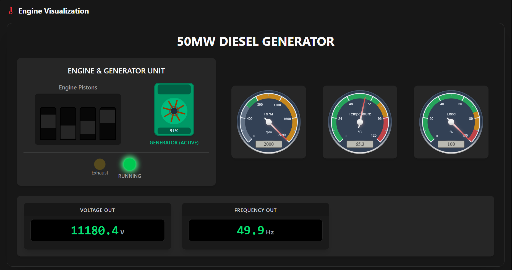
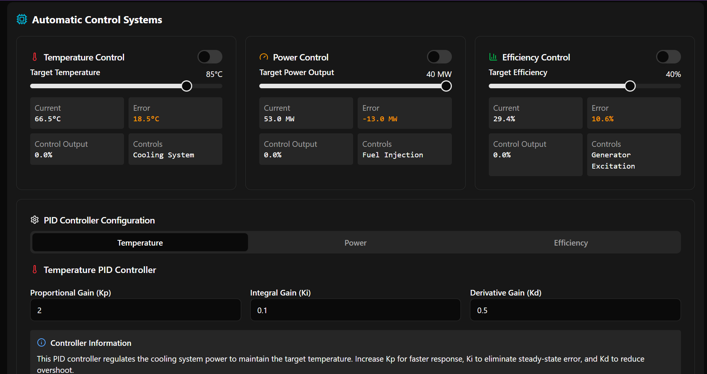

# DieselOps - Diesel Power Plant Simulator
DieselOps is a comprehensive web-based simulator for a 50MW diesel power plant engine (1 of 10 for a total of 500MW Capacity), providing an interactive interface to visualize, control, and monitor diesel generator operation in real-time.

> This project was intended for school purposes as part of a research section on the design of a 500MW diesel power plant.


## Features
### 1. Real-time Engine Visualization
Interactive animation of diesel engine components including pistons, generator, and cooling systems

### 2. Dynamic Circuit Diagram
Single line diagram showing power flow from diesel engine through generator and transformer to load

### 3. Realistic Parameter Simulation
Accurate modeling of temperature, efficiency, emissions, voltage, and frequency

### 4. Multiple Control Options
Manual controls for fuel injection, cooling, excitation, and load

### 5. Automatic PID-based control systems
Advanced cascade control for complex parameter relationships

### 6. Monitoring Dashboards
Real-time graphs showing power output, temperature, and efficiency trends

### 7. Emergency Mode
Simulate emergency situations and test failsafe mechanisms

### 8. System Status Tracking
Comprehensive health monitoring with maintenance status indicators

## Tech Stack
- React 19 with TypeScript for UI components
- Tailwind CSS for styling
- Radix UI primitives for accessible components
- Canvas API for visualizations (circuit diagram, power graphs)
- Custom animation for engine visualization
- Zustand state management solution for simulation logic

## Getting Started
Prerequisites
- Node.js (v20.x LTS or higher)
- npm, yarn or pnpm

### Installation
#### Install dependencies using your package manager of choice
```bash
npm install
```
> use `--legacy-peer-deps` in case of peer dependencies conflict.

#### Start the development server
```bash
npm run dev
```

### Usage
The simulator provides a comprehensive interface to:

1. Start/Stop the diesel engine
2. Adjust parameters like fuel injection rate, cooling power, and generator excitation
3. Monitor real-time data on power output, temperature, efficiency, etc.
4. Test automatic control systems with PID controllers
5. Implement cascade control strategies for advanced parameter management
6. Visualize power flow through the single-line diagram

#### Engine Visualization with gauge readings


#### Automatic Control System
